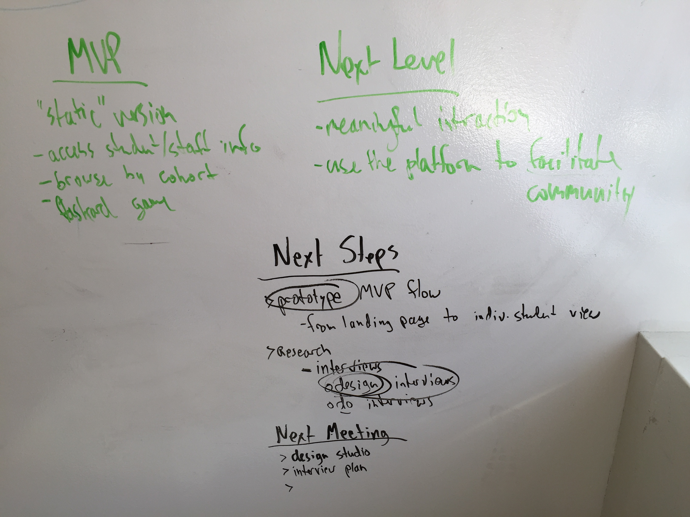
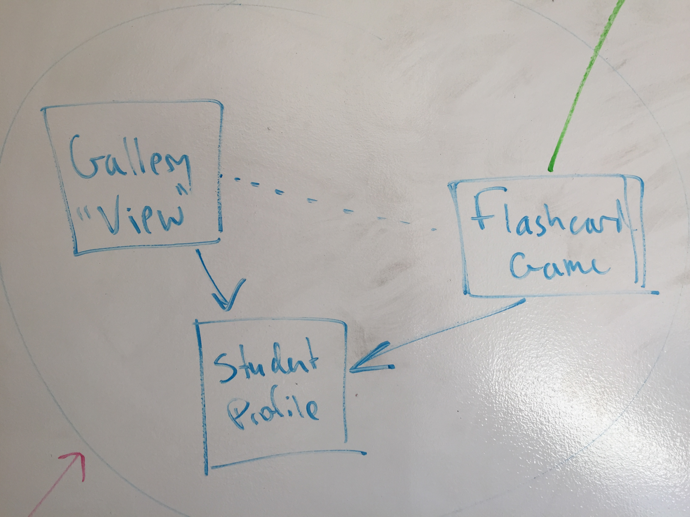
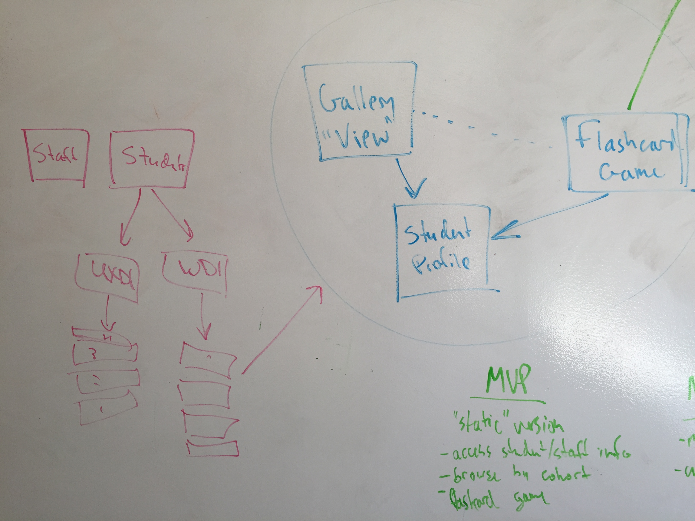
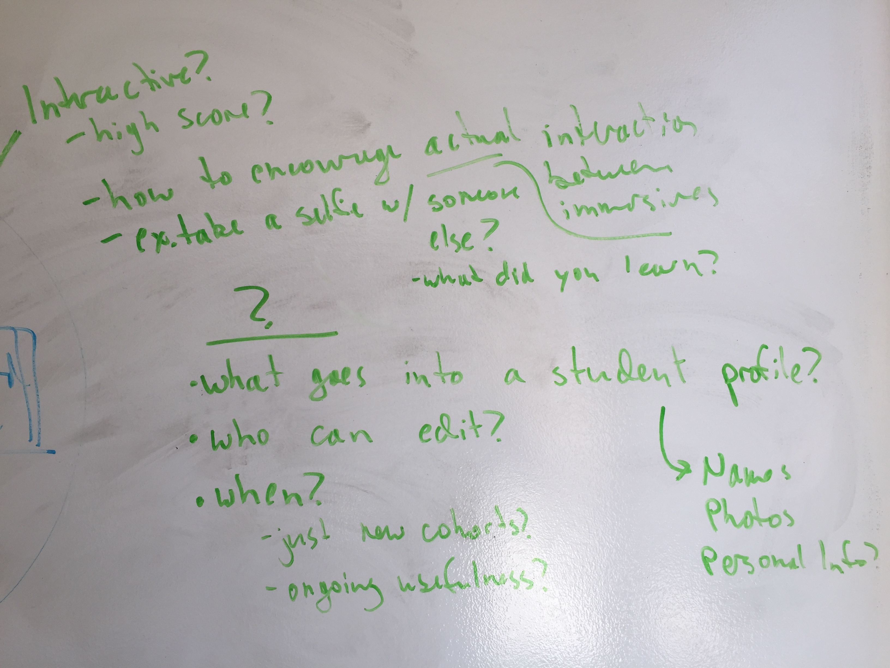

#First Meeting (July 10) Notes

##Features/Goals

###MVP
* "static" version
* access to student and staff info
* browse by cohort
* flashcard game (view)

###Next Level
* The app helps facilitate community development and meaningful interaction

##Next Steps
* **Prototype** MVP flow from landing page to individual student profile
* Research
  * Design **interviews**

##Next Meeting
* design Studio
* interview plan

##Photos

next steps, MVP, and Next Level

Pieces we have

Flow

Features and Questions
